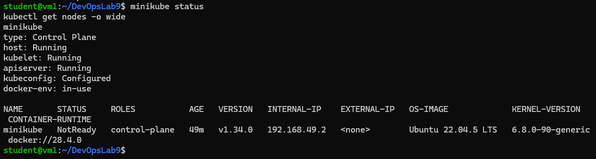
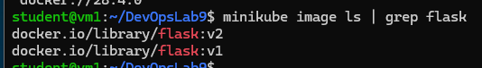
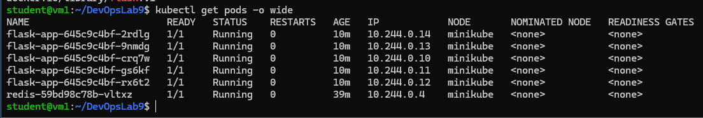
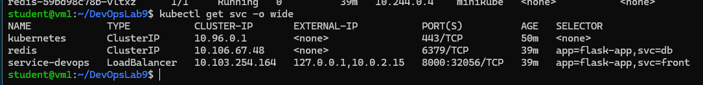
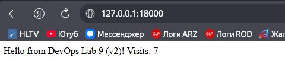
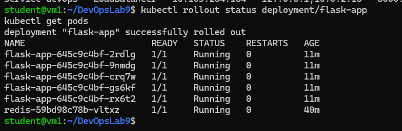

# DevOps Lab 9 — Kubernetes basics (Flask + Redis) + RollingUpdate

**Демидов Матвей Александрович, ФИТ-1-2024 НМ**  
**Дисциплина:** Методы и инструменты DevOps  
**Лабораторная работа:** ЛР 9 (Kubernetes basics)

---

## 1) Задание
Нужно “куберизировать” приложение **Flask + Redis** (можно брать из ЛР8) и развернуть в **minikube**:

- **Flask**
  - `Deployment` (5 реплик)
  - `Service` типа **LoadBalancer**
  - порт **8000 → 5000**
  - `externalIPs: [10.0.2.15]`
- **Redis**
  - `Deployment` (1 реплика)
  - `Service` типа **ClusterIP**
- Проверить работу приложения (endpoint доступен из Windows)
- Обновить Flask на новую версию через **RollingUpdate** (`kubectl set image ...`)

**Что обязательно положить в репо:**
- `k8s/` (манифесты)
- `README.md` (как собрать образ, minikube tunnel, kubectl get pods/svc, как обновлять image/tag)
- `screens/` (pods 5 реплик, services, работающий endpoint)

---

## 2) Стенд и доступ
Работа выполнялась на **VM1 (minikube)**: `10.0.2.15`  
SSH из Windows: `ssh student@127.0.0.1 -p 2222`

**Port forwarding (VirtualBox → VM1):**
- App: `http://127.0.0.1:18000`  → `VM1:8000`
- SSH: `127.0.0.1:2222` → `VM1:22`

---

## 3) Структура репозитория
```
DevOpsLab9/
  k8s/
    flask-deploy.yaml
    flask-svc.yaml
    redis-deploy.yaml
    redis-svc.yaml
  flask_redis/             # исходники + Dockerfile (если используете из ЛР8)
  screens/                 # скриншоты выполнения
  logs/                    # (не обязательно) логи команд
  README.md
```

---

## 4) Выполнение (VM1)

### 4.1 Проверка кластера
```bash
minikube status
kubectl get nodes -o wide
```

### 4.2 Сборка образа Flask внутри minikube
> Важно: образ должен быть доступен minikube, поэтому билд делаю после `eval $(minikube docker-env)`.

```bash
cd ~/DevOpsLab9
eval $(minikube docker-env)

docker build -t flask:v1 ./flask_redis
minikube image ls | grep flask
```

### 4.3 Применение манифестов
```bash
kubectl apply -f k8s/
kubectl get pods -o wide
kubectl get svc -o wide
```

---

## 5) Доступ с Windows (нужен minikube tunnel)
В **отдельном терминале** на VM1 (и не закрывать):
```bash
sudo minikube tunnel --bind-address 10.0.2.15
```

Проверка на VM1:
```bash
curl -s http://10.0.2.15:8000 | head -n 5
```

Проверка на Windows:
- открыть `http://127.0.0.1:18000`

---

## 6) RollingUpdate (Flask v1 → v2)

### 6.1 Меняю текст в приложении (чтобы “до/после” отличались)
```bash
cd ~/DevOpsLab9
grep -RIn --exclude-dir=.git "DevOps Lab" flask_redis
```

Далее меняю строку (пример):
- было: `DevOps Lab 8`
- стало: `DevOps Lab 9 (v2)`

Через команду (без ручного редактора):
```bash
FILE="./flask_redis/app.py"   # <-- подставить свой путь из grep
cp -a "$FILE" "${FILE}.bak"
sed -i 's/DevOps Lab 8/DevOps Lab 9 (v2)/g' "$FILE"
grep -n "DevOps Lab" "$FILE"
```

### 6.2 Собираю новый образ `flask:v2`
```bash
cd ~/DevOpsLab9
eval $(minikube docker-env)
docker build -t flask:v2 ./flask_redis
minikube image ls | grep flask
```

### 6.3 Обновляю deployment и проверяю rollout
```bash
kubectl set image deployment/flask-app flask=flask:v2
kubectl rollout status deployment/flask-app
kubectl get pods -o wide
```

### 6.4 Как сделать скрины “до/после” реально разными
Если я по ошибке снял оба скрина уже на v2 (и они отличаются только Visits),
то делаю так:

```bash
# 1) вернуться на v1 (для скрина "до")
kubectl set image deployment/flask-app flask=flask:v1
kubectl rollout status deployment/flask-app

# (снимаю скрин браузера: screens/05_browser_v1.png)

# 2) снова перейти на v2 (для скрина "после")
kubectl set image deployment/flask-app flask=flask:v2
kubectl rollout status deployment/flask-app
```

Чтобы браузер не показывал кэш, открываю так:
- `http://127.0.0.1:18000/?t=1`
- `http://127.0.0.1:18000/?t=2`

---

## 7) Скриншоты (screens/)
Скриншоты складываю в папку `screens/` (имена файлов — как ниже).

### 7.1 Кластер поднят


Команды, которые были на экране:
```bash
minikube status
kubectl get nodes -o wide
```

### 7.2 Образ(а) есть в minikube


```bash
minikube image ls | grep flask
```

### 7.3 Pods (5 реплик Flask + 1 Redis)


```bash
kubectl get pods -o wide
```

### 7.4 Services (Flask LoadBalancer + Redis ClusterIP)


```bash
kubectl get svc -o wide
```

### 7.5 Браузер “до RollingUpdate” (v1)


Открыто в Windows: `http://127.0.0.1:18000`

### 7.6 Rollout


```bash
kubectl rollout status deployment/flask-app
```

### 7.7 Браузер “после RollingUpdate” (v2)


---

## 8) Команды для логов (не обязательно, но удобно)
```bash
mkdir -p ~/DevOpsLab9/logs
minikube status | tee ~/DevOpsLab9/logs/01_minikube_status.log
kubectl get nodes -o wide | tee ~/DevOpsLab9/logs/02_nodes.log
kubectl get pods -o wide | tee ~/DevOpsLab9/logs/03_pods.log
kubectl get svc -o wide | tee ~/DevOpsLab9/logs/04_services.log
```

---

## 9) Push в GitHub (делал с Windows)
Порядок такой же, как в предыдущих ЛР: копирую проект с VM1, добавляю `screens/`, пушу.

### 9.1 Папки на Windows
```powershell
$LAB = "$env:USERPROFILE\Downloads\bots\Отчет\Lab9"
mkdir "$LAB\repo" -Force | Out-Null
mkdir "$LAB\repo\screens" -Force | Out-Null
```

### 9.2 Скопировать проект с VM1
```powershell
$LAB = "$env:USERPROFILE\Downloads\bots\Отчет\Lab9"
scp -r -P 2222 student@127.0.0.1:~/DevOpsLab9/* "$LAB\repo\"
```

### 9.3 Добавить скрины в repo
```powershell
$LAB = "$env:USERPROFILE\Downloads\bots\Отчет\Lab9"
copy "$LAB\screens\*.png" "$LAB\repo\screens\" -Force
```

### 9.4 Git push
```powershell
$LAB = "$env:USERPROFILE\Downloads\bots\Отчет\Lab9"
cd "$LAB\repo"

git init
git add .
git commit -m "Lab9: Kubernetes + RollingUpdate"
git branch -M main
git remote remove origin 2>$null
git remote add origin https://github.com/torenDM/DevOpsLab9.git
git push -u origin main
```
